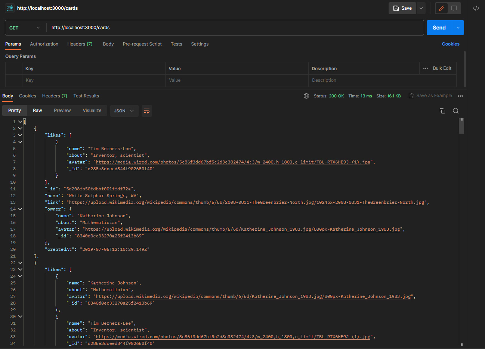
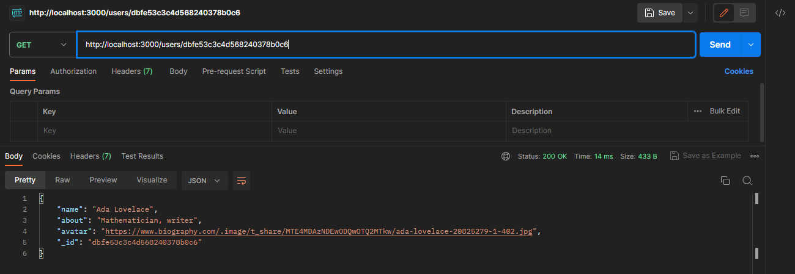

# Around Express ID

## Project Description

 Proyek "Around Express ID" adalah sebuah aplikasi web yang memungkinkan pengguna untuk berbagi dan menjelajahi foto-foto menarik dari berbagai tempat. Pengguna dapat melihat daftar pengguna, daftar kartu foto, dan juga melihat profil pengguna berdasarkan ID

## Technologies

This project utilizes several technologies and techniques, including:
- **Express.js:** A backend framework used for creating routes and handling HTTP requests.
- **File System (fs) dan Path Module:** Used for reading JSON data files and managing file paths.
- **REST API:** Employed to provide endpoints that enable the retrieval of user and photo card data.

## Features

1. Displaying a list of users that can be viewed by visitors.
2. Displaying a list of photo cards containing captivating images from various places.
3. Displaying user profiles based on their IDs, including photos uploaded by users.

## Screenshots

## Directories  
  
`/data` — JSON files to temporarily emulate database integration.  
  
`/routes` — routing files.  
  
All other directories are optional and may be created by the developer if necessary.   
  
## Running the Project  
  
`npm run start` — to launch the server.  
  
`npm run dev` — to launch the server with the hot reload feature.  

